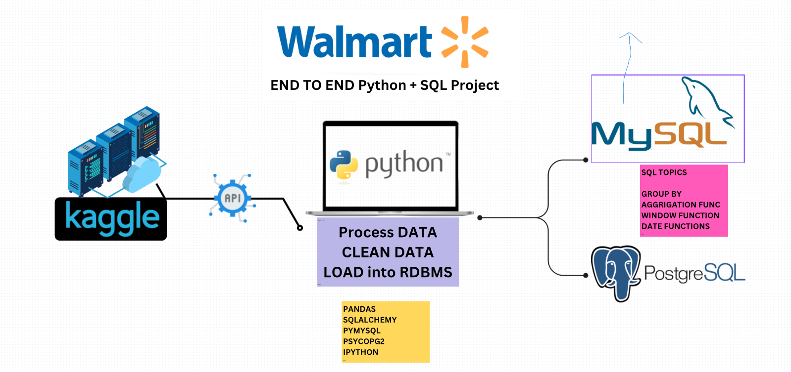

# Walmart Sales Analysis — End-to-End Retail Analytics

An end-to-end retail analytics project that transforms Walmart sales transactions into business-ready data and answers nine operational questions with Python, MySQL, and PostgreSQL.

> **Portfolio focus:** data cleaning, feature engineering, relational loading, SQL analytics, retail KPI design, branch comparison, payment behavior, ratings, profitability, and year-over-year revenue analysis.

## Business objective

Retail teams need to understand what customers buy, how they pay, which categories and branches perform best, when demand is concentrated, and where revenue is declining. This project follows a realistic analyst workflow: profile the raw data, clean and enrich it with Python, load the prepared data into relational databases, and use SQL to produce decision-oriented outputs.

## Dataset and quality

The raw dataset contains **10,051 transactions and 11 fields** covering invoice, branch, city, category, unit price, quantity, date, time, payment method, rating, and profit margin. The records span **1 January 2019 to 31 December 2023**.

The raw file contains **51 duplicate rows** and 31 missing values in both unit price and quantity. The cleaned file contains **9,969 rows, zero duplicate rows, and no missing values** after the notebook’s cleaning and feature-preparation steps.

The repository’s cleaned data supports derived revenue as unit price multiplied by quantity and derived profit as revenue multiplied by profit margin. On the cleaned file, the calculated revenue is approximately **$1.21 million** and the calculated profit is approximately **$476.1 thousand**. These are portfolio calculations based on the supplied data, not audited financial statements.

## Visual evidence

## Business questions answered

The SQL analysis covers payment-method transaction counts and quantities, the highest-rated category in each branch, the busiest weekday by branch, quantity sold by payment method, category rating ranges by city, total profit by category, preferred payment method by branch, morning/afternoon/evening sales shifts, and branches with the largest year-over-year revenue decline.

## Verified descriptive findings

Credit card is the most common payment method with **4,260 transactions**, followed by Ewallet with 3,911 and Cash with 1,880. Fashion accessories and Home and lifestyle are the two largest categories by transaction count and each contributes approximately **$489 thousand** in calculated revenue. Credit card transactions contribute approximately **$488.8 thousand** in calculated revenue, ahead of Ewallet at approximately $457.3 thousand.

The mean customer rating in the raw file is approximately **5.83** on the supplied 3.0–10.0 scale. These findings are descriptive comparisons; they do not establish that a payment method or category causes higher revenue.

## Analytical workflow

The notebook profiles the schema, checks missingness and duplicates, standardizes numeric and date fields, removes unusable records, and prepares a cleaned dataset. The SQL files then reproduce the business logic in both MySQL and PostgreSQL dialects.

The project uses window functions such as RANK over branch partitions to identify leaders, common table expressions to structure multi-step calculations, date functions to derive weekdays and year-over-year comparisons, and dialect-aware date parsing for MySQL and PostgreSQL.

## Retail KPI framing

The central measures are transaction count, quantity sold, calculated revenue, calculated profit, average rating, payment-method mix, category mix, shift mix, branch performance, and year-over-year revenue change. Revenue is defined as unit price multiplied by quantity. Profit is defined as revenue multiplied by the supplied profit-margin field.

## Business recommendations

Use payment-method mix to guide checkout and reconciliation reviews, but compare conversion, refund, and failure rates before changing payment priorities. Evaluate category performance with revenue and calculated profit rather than transaction count alone. Investigate branch-level declines with a time-based diagnostic that separates demand, assortment, pricing, and data-coverage effects. Preserve the cleaned-data quality checks as part of any refresh process.

## Repository structure

The repository contains the raw and cleaned CSV files, the exploratory notebook, the MySQL and PostgreSQL query files, business-problem documentation, and portfolio visual assets.

## Tools and methods

Python · Pandas · SQLAlchemy · MySQL · PostgreSQL · Jupyter Notebook · CTEs · Window Functions · Date Functions · Feature Engineering

## Run locally

Clone the repository, create a Python environment, and install the pinned dependencies with pip install -r requirements.txt. Open notebooks/walmart_analysis.ipynb to review the cleaning and feature-engineering workflow. Load data/walmart_clean_data.csv into MySQL or PostgreSQL, then run the matching SQL file in sql_queries/.

## Reproducibility notes

The SQL scripts expect a prepared relational table with fields corresponding to the cleaned dataset and a derived total revenue field for the year-over-year query. Review the notebook and SQL comments before loading the data so date parsing and calculated fields match the documented definitions.

## Limitations and next steps

This is a portfolio case study based on a supplied transaction dataset. A production-ready version would add automated data-quality tests, a documented database-loading script, a data dictionary, a refresh timestamp, branch-level confidence intervals, and a time-based dashboard export. The next analytical extension would be a controlled comparison of payment methods or a forecasting baseline for branch revenue.

---

*Part of Mayank Srivastava’s Data Analyst portfolio.*
